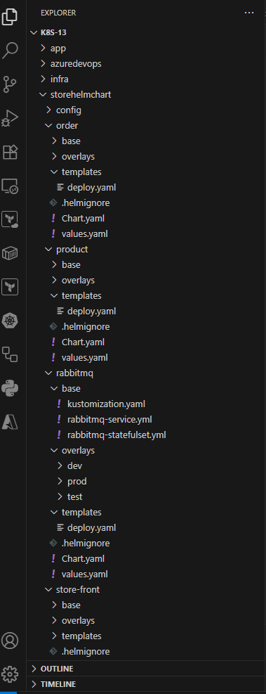

# Part 13: Deploying microservice applications in AKS using Helm Chart and Kustomize

    Overlay First Approach

    Part1:   Manual Deployment (AzCLI + Docker Desktop + kubectl)  
    GitHub:  https://github.com/santosh-gh/k8s-01
    YouTube: https://youtu.be/zoJ7MMPVqFY

    Part2:   Automated Deployment (AzCLI + Docker + kubect + Azure Pipeline)
    GitHub:  https://github.com/santosh-gh/k8s-02
    YouTube: https://youtu.be/nnomaZVHg9I

    Part3:   Automated Infra Deployment (Bicep + Azure Pipeline)
    GitHub:  https://github.com/santosh-gh/k8s-03
    YouTube: https://www.youtube.com/watch?v=5PAdDPHn8F8

    Part4:   Manual Deployment (AzCLI + Docker Desktop + Helm charts + kubectl) 
    GitHub:  https://github.com/santosh-gh/k8s-04
    YouTube: https://www.youtube.com/watch?v=VAiR3sNavh0

    Part5:   Automated Deployment (AzCLI + Docker + Helm charts + kubectl + Azure Pipeline) 
    GitHub:  https://github.com/santosh-gh/k8s-04
    YouTube: https://www.youtube.com/watch?v=MnWe2KGRrxg&t=883s

    Part6:   Automated Deployment (AzCLI + Docker + Helm charts + kubectl + Azure Pipeline) 
             Dynamically update the image tag in values.yaml
    GitHub:  https://github.com/santosh-gh/k8s-06
    YouTube: https://www.youtube.com/watch?v=Nx0defm8T6g&t=11s

    Part7:   Automated Deployment (AzCLI + Docker + Helm charts + kubectl + Azure Pipeline)
             Store the helm chart in ACR
             Dynamically update the image tag in values.yaml
             Dynamically update the Chart version in Chart.yaml

    GitHub:  https://github.com/santosh-gh/k8s-07
    YouTube: https://www.youtube.com/watch?v=Y3RaxSZNTaU&t=1s

    Part8:   Automated Deployment (AzCLI + Docker + Helm charts + kubectl + Azure Pipeline)
             Store the helm chart in ACR
             Dynamically update the image tag in values.yaml
             Dynamically update the Chart version in Chart.yaml
             Deploy into multiple environments (dev, test, prod) with approval gates

    GitHub:  https://github.com/santosh-gh/k8s-08
    YouTube: https://www.youtube.com/watch?v=oNysAAGijGk&t=43s

    Part9:   Manual Deployment (AzCLI + Docker + kustomize + kubectl)          
             Deploy into multiple environments (dev, test, prod) through command line

    GitHub:  https://github.com/santosh-gh/k8s-09
    YouTube: https://www.youtube.com/watch?v=Jtz1KldOPAA&t=1s

    Part10:  Automated Deployment (AzCLI + Docker + kustomize + kubectl + Azure Pipeline)          
             Deploy into multiple environments (dev, test, prod) through automated pipeline

    GitHub:  https://github.com/santosh-gh/k8s-10
    YouTube: https://www.youtube.com/watch?v=VAiR3sNavh0

    Part11:  Manual Deployment (AzCLI + Docker + Helm + kustomize + kubectl)          
             Deploy into multiple environments (dev, test, prod) using command line tools.

    GitHub:  https://github.com/santosh-gh/k8s-11
    YouTube: https://www.youtube.com/watch?v=ZNHoZ_b85DQ&t=6s

    Part12:  Automated Deployment (AzCLI + Docker + Helm + kustomize + kubectl)
             Template First approach 
             Dynamically update the image tag in deploy.yaml         
             Deploy into multiple environments (dev, test, prod) using Azure Pipeline.

    GitHub:  https://github.com/santosh-gh/k8s-12
    YouTube: https://www.youtube.com/watch?v=qxJyTHzWG4U

    Part13:  Manual Deployment (AzCLI + Docker + Helm + kustomize + kubectl)
             Overlay First approach             
             Deploy into multiple environments (dev, test, prod) thorough commands.

    GitHub:  https://github.com/santosh-gh/k8s-13
    YouTube: https://www.youtube.com/watch?v=VAiR3sNavh0

# Architesture

    # Store front: Web application for customers to view products and place orders.
    # Product service: Shows product information.
    # Order service: Places orders.
    # RabbitMQ: Message queue for an order queue.

# Directory Structure

# Tetechnology Stack

    Azure Pipelines
    Infra (AzCLI/Bicep)
    AKS
    ACR
    Helm
    kustomization

    # HELM
    Helm works in the concept of templating

    A template is a form that has placeholders that an automated process will 
    parse to replace them with values.

    # KUSTOMIZE
    Kustomize is a native K8s tool for customizing K8s objects.

    Kustomize works in the concept of overlays.
    An overlay is a set of replacement strings. 
    Blocks of text in the original file are entirely replaced with new blocks of text

    A template-free way to customize application configuration without 
    modifying the original resource files using a declarative approach.

    Kustomize employs overlays to apply specific changes for different environments, making it 
    ideal for managing configurations across multiple environments of the application.

    If we want to change, add, or remove some configuration. we can use Kustomize to set up the base 
    resources and patch the configuration on top of the base resources based on different overlays.     
    
    Also benefits in moving the repeated parts of the config across resources to 
    the overlays layer to easily manage those configs.

    There are 2 approches for using Helm and Kustomize togeteher:

    1. Template First

       Pros: Can fully utilize helm features.

       Cons: No release versioning and rollbacks.

    2. Overlay First

       Pros: Helm’s packaging and versioning
             Release versioning and rollbacks

        Cons: Limited helm benefits

# Steps

    1. Infra deployment using AzCLI command line tool

    2. Build and push images to ACR: Docker Desktop

    3. Install Helm & Kustomize

       Kustomize comes pre bundled with kubectl version >= 1.14

       Linux: sudo install -o root -g root -m 0755 kustomize /usr/local/bin/kustomize
       Mac: brew install kustomize
       Windows: choco install kustomize

       kustomize version 

    4. Update base and overlays template manifests to generate the helm template     

    5. App deployment        

    6. Validate and Access the application

    7. Clean the Azure resources
    
# Infra deployment

    # Login to Azure

    az login
    az account set --subscription=<subscriptionId>
    az account show

    # Show existing resources

    az resource list

    # Create RG, ACR and AKS

    # AzCLI
    ./infra/azcli/script.sh

    OR

    # Bicep
    az deployment sub create --location uksouth --template-file ./infra/bicep/main.bicep --parameters ./infra/bicep/main.bicepparam

    # Connect to cluster

    RESOURCE_GROUP="rg-onlinestore-dev-uksouth-001"
    AKS_NAME="aks-onlinestore-dev-uksouth-001"
    az aks get-credentials --resource-group $RESOURCE_GROUP --name $AKS_NAME --overwrite-existing

    # Short name for kubectl
    alias k=kubectl

    # Create name spaces
    k create ns dev
    k create ns test
    k create ns prod    

    # Show all existing objects
    k get all

# Docker Build and Push to ACR

    # Log in to ACR

    ACR_NAME="acronlinestoredevuksouth001"
    az acr login --name $ACR_NAME

    docker images

    # Build and push the Docker images to ACR

    # Order Service
    docker build -t order ./app/order-service 
    docker tag order:latest $ACR_NAME.azurecr.io/order:v1
    docker push $ACR_NAME.azurecr.io/order:v1

    # Product Service
    docker build -t product ./app/product-service 
    docker tag product:latest $ACR_NAME.azurecr.io/product:v1
    docker push $ACR_NAME.azurecr.io/product:v1

    # Store Front Service
    docker build -t store-front ./app/store-front 
    docker tag store-front:latest $ACR_NAME.azurecr.io/store-front:v1
    docker push $ACR_NAME.azurecr.io/store-front:v1    

# Install Helm 

# Install Kustomize

    Kustomize comes pre bundled with kubectl version >= 1.14

    Linux: sudo install -o root -g root -m 0755 kustomize /usr/local/bin/kustomize
    Mac: brew install kustomize
    Windows: choco install kustomize

    kustomize version 

# Update base and overlays template manifests to generate the helm template (deploy.yaml)

    kustomize build ./storehelmchart/config/base > ./storehelmchart/config/templates/deploy.yaml
    kustomize build ./storehelmchart/rabbitmq/overlays/dev > ./storehelmchart/rabbitmq/templates/deploy.yaml
    kustomize build ./storehelmchart/order/overlays/dev > ./storehelmchart/order/templates/deploy.yaml
    kustomize build ./storehelmchart/product/overlays/dev > ./storehelmchart/product/templates/deploy.yaml
    kustomize build ./storehelmchart/store-front/overlays/dev > ./storehelmchart/store-front/templates/deploy.yaml

    kustomize build ./storehelmchart/rabbitmq/overlays/test > ./storehelmchart/rabbitmq/templates/deploy.yaml
    kustomize build ./storehelmchart/order/overlays/test > ./storehelmchart/order/templates/deploy.yaml
    kustomize build ./storehelmchart/product/overlays/test > ./storehelmchart/product/templates/deploy.yaml
    kustomize build ./storehelmchart/store-front/overlays/test > ./storehelmchart/store-front/templates/deploy.yaml

    kustomize build ./storehelmchart/rabbitmq/overlays/prod > ./storehelmchart/rabbitmq/templates/deploy.yaml
    kustomize build ./storehelmchart/order/overlays/prod > ./storehelmchart/order/templates/deploy.yaml
    kustomize build ./storehelmchart/product/overlays/prod > ./storehelmchart/product/templates/deploy.yaml
    kustomize build ./storehelmchart/store-front/overlays/prod > ./storehelmchart/store-front/templates/deploy.yaml

# Review deploy manifest (apply patches)    

    helm template ./storehelmchart/config
    helm template ./storehelmchart/rabbitmq
    helm template ./storehelmchart/order
    
    helm template ./storehelmchart/product
    helm template ./storehelmchart/store-front

# Apply the helm chart

    helm install config ./storehelmchart/config -n dev
    helm install rabbitmq ./storehelmchart/rabbitmq -n dev
    helm install order ./storehelmchart/order -n dev
    helm install product ./storehelmchart/product -n dev
    helm install store-front ./storehelmchart/store-front -n dev

    helm install config ./storehelmchart/config -n test
    helm install rabbitmq ./storehelmchart/rabbitmq -n test
    helm install order ./storehelmchart/order -n test
    helm install product ./storehelmchart/product -n test
    helm install store-front ./storehelmchart/store-front -n test

    helm install config ./storehelmchart/config -n prod
    helm install rabbitmq ./storehelmchart/rabbitmq -n prod
    helm install order ./storehelmchart/order -n prod
    helm install product ./storehelmchart/product -n prod
    helm install store-front ./storehelmchart/store-front -n prod

# Verify the Deployment

    k get pods -n dev
    k get services -n dev

    curl <LoadBalancer public IP>:80
    Browse the app using http://<LoadBalancer public IP>:80

# Clean the k8s namespace

    k delete all --all -n default
    k delete all --all -n dev
    k delete all --all -n test
    k delete all --all -n prod

# Clean the Azure resources

    az group delete --name rg-onlinestore-dev-uksouth-001 --yes --no-wait